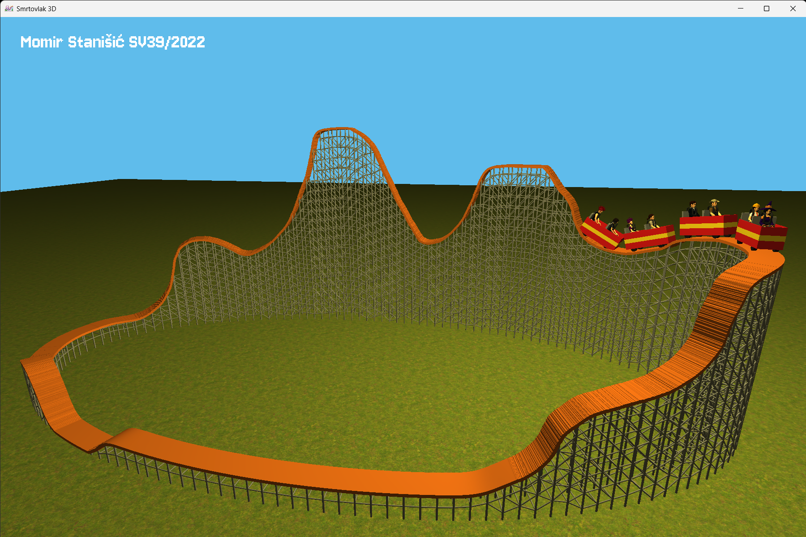

## Usage
- `Esc` – Quit the application  
- `F` – Toggle fullscreen  
- `E` – Toggle free-fly camera mode  
- `Space` – Add a new passenger  
- `Enter` – Start the ride (requires all passengers to be buckled up)  
- `Numbers` – Buckle passengers / make them sick during the ride  
- `WASD` – Move the camera  
- `Mouse` – Rotate the camera  

## Track Loading
The track is loaded from the `smrtovlak.track` file.  
You can create this file using the designer from the [smrtovlak 2D](https://github.com/momir64/smrtovlak) project.

## Screenshot

